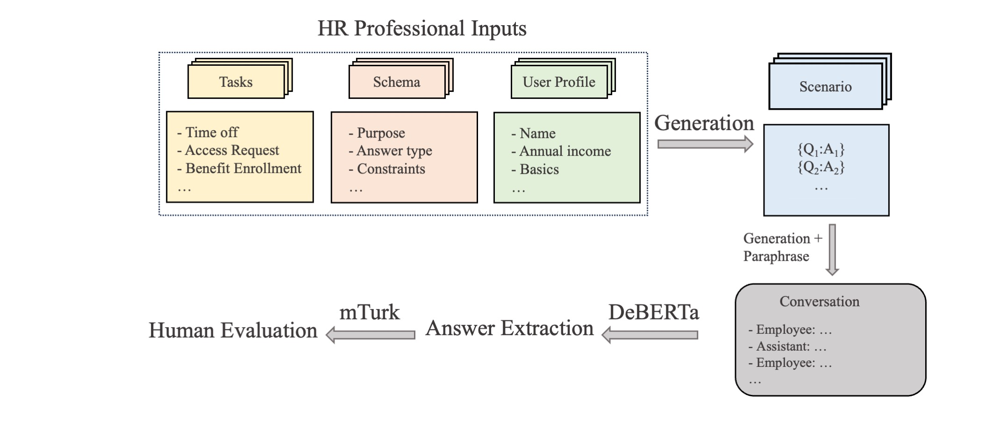

# HR-MultiWOZ: A Task Oriented Dialogue (TOD) Dataset for HR LLM Agent

This repository hosts the data generation recipe and benchmarking of [HR-MultiWOZ](https://arxiv.org/abs/2402.01018): A Task Oriented Dialogue (TOD) Dataset for HR LLM Agent. This paper is accepted by EACL NLP4HR workshop as presentations. 

## Citation
```
@misc{xu2024hrmultiwoz,
      title={HR-MultiWOZ: A Task Oriented Dialogue (TOD) Dataset for HR LLM Agent}, 
      author={Weijie Xu and Zicheng Huang and Wenxiang Hu and Xi Fang and Rajesh Kumar Cherukuri and Naumaan Nayyar and Lorenzo Malandri and Srinivasan H. Sengamedu},
      year={2024},
      eprint={2402.01018},
      archivePrefix={arXiv},
      primaryClass={cs.CL}
}
```

## Data
!Please note that the dataset is an independent reimplementation of our methods. It is not release by Amazon. 
All dataset is under Data folder.
sgd_dataset.pkl: This is the schema guided dataset.
template.pkl: This is the place where you can access the question for each entity.
qa_dataset.pkl: This is the place where you can get question, context and extractive answers. 

## Flow



## :trophy: TOD Benchmarks

| JAG    | slot accuracy   | Method                        |
|--------|-----------------|-------------------------------|
| **18.89**  | **55.61**          | TransferQA with Deberta[11]                   |
| 8.65   | 26.62           | TransferQA with Bert[11]                   |


Since most of multiwoz dataset is from other domain and is hard to do transfer learning, we can only implement our own baseline. The baseline is inspired by [11] and we select 2 best performing models from below as our base language model. Check leadership/tod_benchmark.py for our implementation. 

As you can see, the performance is still really bad. This means that existed SGD method may not be able to transfer to do transfer learning in our use case. 

You can follow leaderboard/tod_benchmark.py to benchmark you own methods. 

You can also benchmark any question answering model from huggingface using the following code:
```
python3 leaderboard/qa_benchmark_evaluation.py --name [adding model name] --threshold [adding threshold between 0 and 1 to define the confidence]
```

## :trophy: Extractive QA Benchmarks
| F1    | Exact Match | BLEU    | Method                        |
|-------|-------------|---------|-------------------------------|
|**0.786**  | **0.598**       | 0.174   | bert-large-fintuned-squad [10]      |
|0.721  | 0.519       | 0.168   | distilbert-base [9]          |
|0.710  | 0.000       | **0.217**   | deberta-v3-large [7]         |
|0.642  | 0.000       | 0.140   | roberta-base-squad2 [3]      |
|0.588  | 0.000       | 0.134   | mdeberta-v3-base [8]         |
|0.045  | 0.000       | 0.011   | bert-base-uncased [1]        |
|0.047  | 0.000       | 0.010   | distilbert-base-uncased [2]  |
|0.050  | 0.000       | 0.011   | albert [4]                   |
|0.050  | 0.001       | 0.011   | electra-small-discriminator [5] |
|0.072  | 0.000       | 0.020   | xlnet-base [6]               |


bert-large-uncased is finetuned through whole word masking on Squad dataset. This method achieves the best performance.
 https://huggingface.co/google-bert/bert-large-uncased-whole-word-masking-finetuned-squad

The code to benchmark your extractive QA method
```
import pickle
import pandas as pd
from leaderboard.metric import calculate_f1_score, calculate_exact_match, calculate_bleu, calculate_rouge, calculate_meteor


#loading qa_dataset
with open('qa_dataset.pkl', 'rb') as f:
    data = pickle.load(f)
#putting your predicted answer in data
data['predicted_answer'] = ...

#benchmark
F1 = calculate_f1_score(evaluations['answer'], evaluations[method])
Exact_Match = calculate_exact_match(evaluations['answer'].tolist(), evaluations[method].tolist())
Bleu = calculate_bleu(evaluations['answer'], evaluations[method])

```

## Introduction

HR-Multiwoz is a fully-labeled dataset of 550 conversations spanning 10 HR domains to evaluate LLM Agent. It is the first labeled open-sourced conversation dataset in the HR domain for NLP research. In this repo we provides a detailed recipe for the data generation procedure described in the paper along with data analysis and human evaluations. The data generation pipeline is transferable and can be easily adapted for labeled conversation data generation in other domains. The proposed data-collection pipeline is mostly based on LLMs with minimal human involvement for annotation, which is time and cost-efficient. 

## Requirements

Install all required python dependencies:

```
pip install -r requirements.txt
```

## Reference
[1] https://arxiv.org/abs/1810.04805

[2] https://arxiv.org/abs/1910.01108

[3] https://huggingface.co/deepset/roberta-base-squad2

[4] https://arxiv.org/abs/1909.11942

[5] https://openreview.net/pdf?id=r1xMH1BtvB

[6] https://proceedings.neurips.cc/paper_files/paper/2019/file/dc6a7e655d7e5840e66733e9ee67cc69-Paper.pdf

[7] https://arxiv.org/abs/2111.09543

[8] https://arxiv.org/abs/2111.09543

[9] https://arxiv.org/abs/1910.01108

[10] https://arxiv.org/abs/1810.04805

[11] https://arxiv.org/pdf/2109.04655.pdf
## Security

See [CONTRIBUTING](CONTRIBUTING.md#security-issue-notifications) for more information.

## License

This project is licensed under the Apache-2.0 License.


